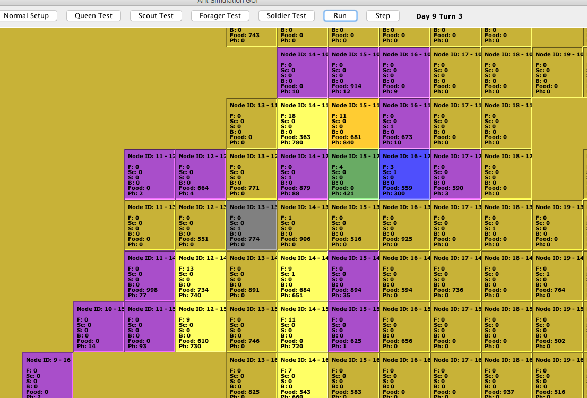

# Ant Colony Simulation

This Java app simulates the characteristic of an ant colony - with various types of colony members, assigned different duties. The ants can move around the colony, attack, forage, defend, etc. based on the type of ant they are. The simulator allows the user to advance through several "days" where the ant colony performs a collection of random tasks. Eventually the ant colony will die out once the queen is attacked. 

This app was created as part of my master's program in a class centered on learning OOP in Java.

## Simulation Example

Launch the simulator by compiling the project and running it via ```Driver.java```.


The GUI will open, giving the user options to start with ```Normal Setup```, which will cause a 3x3 grid to appear, representing the beginning of the colony.


The user can click on ```Step``` to advance the simulation step-by-step or ```Run``` to have the simulation run on it's own. As the simulation runs the number of days that have passed will increase, and the grid will expand as ants take their actions.



